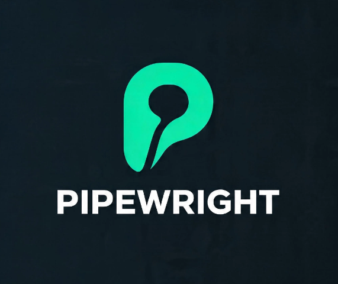

<div align="center">
  

  <br />
  <br />

  <p>Scaffold CI/CD pipelines and project boilerplates — interactively, in seconds.</p>

  <p>
    <a href="https://github.com/BielQuirino/pipewright/actions/workflows/ci.yml">
      
    </a>
    <a href="https://www.npmjs.com/package/pipewright">
      
    </a>
    <a href="https://www.npmjs.com/package/pipewright">
      
    </a>
    <a href="LICENSE">
      
    </a>
    <a href="CONTRIBUTING.md">
      
    </a>
  </p>
</div>

---

## The Problem

Every new project starts the same way: copy-paste a `Dockerfile` from the last repo, tweak a GitHub Actions YAML until the indentation stops breaking, set up ESLint again, configure TypeScript again. This is 30–60 minutes of mechanical work that adds zero business value.

**Pipewright eliminates that.**

---

## Demo

```
$ pipewright init my-api

? Framework: NestJS
? Package manager: pnpm
? Add CI/CD pipeline? Yes
? CI/CD provider: GitHub Actions
? Node version for CI: 20
? Include Dockerfile? Yes
? Include release pipeline? No

✔ Files generated

  create  package.json
  create  tsconfig.json
  create  tsconfig.build.json
  create  nest-cli.json
  create  .gitignore
  create  .eslintrc.js
  create  .prettierrc
  create  src/main.ts
  create  src/app.module.ts
  create  src/app.controller.ts
  create  src/app.service.ts
  create  src/app.controller.spec.ts
  create  test/app.e2e-spec.ts
  create  test/jest-e2e.json
  create  Dockerfile
  create  .dockerignore
  create  .github/workflows/ci.yml

✔ Project my-api created at /projects/my-api

  cd my-api
  pnpm install
```

---

## Installation

```bash
# npm
npm install -g pipewright

# pnpm
pnpm add -g pipewright

# yarn
yarn global add pipewright

# no install needed
npx pipewright init my-project
```

---

## Commands

### `pipewright init [project-name]`

Scaffolds a complete project from scratch — framework files, configs, and CI/CD pipeline.

```
Options:
  -f, --framework <framework>     nestjs | vue
  -p, --provider <provider>       github | azure | gitlab
  -m, --package-manager <pm>      npm | pnpm | yarn        (default: npm)
      --node <version>            Node version for CI      (default: 20)
      --docker                    Include Dockerfile
      --release                   Include release/publish pipeline
      --no-pipeline               Skip CI/CD generation
```

**Examples:**

```bash
# Interactive
pipewright init

# NestJS + GitHub Actions + Docker, no prompts
pipewright init my-api --framework nestjs --provider github --docker --yes

# Vue 3 + Azure DevOps + pnpm
pipewright init my-frontend --framework vue --provider azure -m pnpm

# Preview without writing files
pipewright init my-api --framework nestjs --provider github --dry-run
```

---

### `pipewright add pipeline`

Adds a CI/CD pipeline to an **existing** project. Auto-detects framework and package manager.

```bash
# Interactive
pipewright add pipeline

# Non-interactive
pipewright add pipeline --provider github --docker
```

---

### `pipewright add dockerfile`

Adds an optimized **multi-stage Dockerfile** to an existing project.

```bash
# Auto-detect framework
pipewright add dockerfile

# Explicit
pipewright add dockerfile --framework nestjs --port 3000 --node 20
```

---

## Global Options

| Option | Description |
|---|---|
| `-c, --cwd <dir>` | Set the working directory |
| `-y, --yes` | Accept all defaults, skip prompts |
| `--dry-run` | Show what would be created without writing |
| `-F, --force` | Overwrite existing files |
| `--silent` | Only output errors |
| `--no-spinner` | Disable spinners (auto-disabled in CI) |

---

## What Gets Generated

### NestJS + GitHub Actions

```
my-app/
├── src/
│   ├── main.ts
│   ├── app.module.ts
│   ├── app.controller.ts
│   ├── app.controller.spec.ts
│   └── app.service.ts
├── test/
├── .github/
│   └── workflows/
│       └── ci.yml
├── package.json
├── tsconfig.json
├── nest-cli.json
└── .gitignore
```

### Supported Combinations

| | GitHub Actions | Azure DevOps | GitLab CI |
|---|:---:|:---:|:---:|
| **NestJS** | ✅ | ✅ | ✅ |
| **Vue 3** | ✅ | ✅ | ✅ |

---

## Requirements

- Node.js `>=18.17`

---

## Contributing

Contributions are welcome. See [CONTRIBUTING.md](CONTRIBUTING.md) for patterns, architecture explanation, and step-by-step guides to add new providers and generators.

---

## License

MIT — see [LICENSE](LICENSE).

---

## Acknowledgements

Inspired by [create-t3-app](https://github.com/t3-oss/create-t3-app) and the [Nest CLI](https://github.com/nestjs/nest-cli).

<div align="center">
  <sub>Built with ❤️ by <a href="https://github.com/BielQuirino">BielQuirino</a></sub>
</div>
